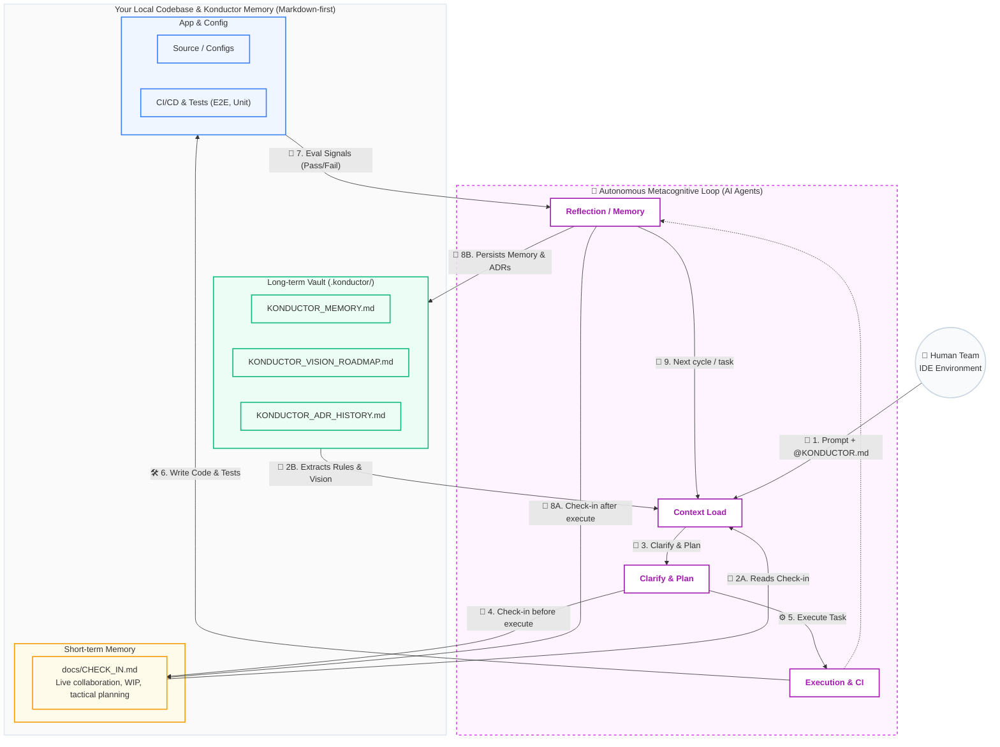

# Workflow

<!-- Machine contract — parsed by agents on every reference_loop read -->
<konductor_workflow version="0.2.11">

  <reference_loop>
    1. Read `KONDUCTOR.md`, `.konductor/memory/KONDUCTOR_VISION_ROADMAP.md`, `.konductor/memory/KONDUCTOR_MEMORY.md`, and `.konductor/memory/KONDUCTOR_ADR_HISTORY.md`.
    2. Inspect `docs/CHECK_IN.md` for active work and unresolved questions.
    3. Update `docs/CHECK_IN.md` with current ongoing task before or during execution, even if work is not yet finished.
    4. Make the change and run the relevant evaluations.
    5. Update `docs/CHECK_IN.md` with active result, current status, and next likely move.
    6. Record critical architectural decisions in `.konductor/memory/KONDUCTOR_ADR_HISTORY.md`.
    7. Promote any new durable rule into `.konductor/memory/KONDUCTOR_MEMORY.md` when future agents should inherit it.
  </reference_loop>

  <behavior_defaults>
    <default>Think before coding: if ambiguity changes architecture, data shape, or user-visible behavior, ask or state assumptions before editing.</default>
    <default>Simplicity first: solve current request with minimum viable change; do not add abstraction, config, or generic layers without immediate need.</default>
    <default>Surgical changes: keep edits tightly tied to task; avoid broad cleanup unless current change makes it necessary or request explicitly asks for it.</default>
    <default>Goal-driven execution: define success before editing; anchor work to failing repro, test, metric, or explicit acceptance check.</default>
    <transform type="bug_fix">reproduce failure → add failing test or explicit repro → implement fix → run regression checks.</transform>
    <transform type="refactor">define behavior to preserve → edit smallest safe surface → run before/after validation.</transform>
    <transform type="performance">define metric or bottleneck → make targeted change → measure result against same signal.</transform>
    <note>These defaults are strong, not absolute. Relax only when user explicitly requests broader restructuring or local architecture makes narrow edits unsafe.</note>
  </behavior_defaults>

  <communication_policy>
    <mode name="konductor" default="true">
      <drop>Articles (a/an/the), filler (just/really/basically), pleasantries (sure/happy to), hedging. Fragments OK.</drop>
      <keep>Exact technical terms, unmodified code blocks, full quoted errors.</keep>
      <pattern>[thing] [action] [reason]. [next step].</pattern>
    </mode>
    <suspend_mode_for>
      <case>Security warnings or destructive operations.</case>
      <case>Irreversible action confirmations.</case>
      <case>Multi-step sequences where fragment order risks misinterpretation.</case>
      <case>Writing normal code, commits, or PRs.</case>
      <case>When human explicitly asks to clarify.</case>
    </suspend_mode_for>
    <compression_tactics>
      <tactic id="1">Zero Padding: No greetings, affirmations, or sign-offs.</tactic>
      <tactic id="2">Diff-Only Output: Show only modified functions. Omit unmodified boilerplate.</tactic>
      <tactic id="3">Symbol Logs: Use ✅ ❌ ⚠️ ⏳ 🔍 instead of text status.</tactic>
      <tactic id="4">No Echo: Never summarize the user's prompt. Start immediately.</tactic>
      <tactic id="5">Standard Abbrevs: req, res, db, env, cfg, ctx, deps.</tactic>
    </compression_tactics>
  </communication_policy>

</konductor_workflow>

---

<!-- Human guide — read by adopters customizing the framework -->

This document is the primary reference guide for using Konductor Workflow inside an adopting repository. It defines the operating model, file responsibilities, and agent behavior expected by the framework. It is intentionally generic and should be adapted to the stack, evaluation loop, and safety requirements of the adopting project.

> **Installation Note:** If you installed the package locally using `npm i konductor-workflow`, your next step is to run `npx konductor-workflow` from your repository root to initialize the Konductor persona and boilerplate documents.

## Framework Blueprint

## 1. Core Concept

A self-improving agent setup combines:

1. A task agent that performs repository work such as fixing bugs, improving tests, or maintaining documentation.
2. A meta agent that analyzes outcomes and modifies the overall agent behavior, including its own prompts, memory, and maintenance loop.
3. A history ledger that preserves evaluated variants, architectural decisions, and notable recoveries so future iterations can branch from explicit Markdown context.

The key difference from a fixed meta-agent design is that the improvement mechanism is itself editable. This enables metacognitive self-modification instead of only task-level optimization.

For the repository's intent and priorities, consult `.konductor/memory/KONDUCTOR_VISION_ROADMAP.md`. For the execution pattern, file responsibilities, and repository-specific checks, use this workflow document as the main usage guide.

## 2. Recommended Components

### Working memory

`.konductor/memory/KONDUCTOR_MEMORY.md` should capture:

- hard stack constraints
- known anti-patterns
- runtime assumptions
- safety boundaries
- lessons that should persist across iterations

### True north

`.konductor/memory/KONDUCTOR_VISION_ROADMAP.md` should capture:

- the repository's WHY
- enduring product intent
- success criteria for the framework
- design principles that should outlive individual implementation choices

### Agent contract vs shared coordination

`KONDUCTOR.md` should stay short, repo-specific, and relatively stable so it can be tagged in every user turn or nearly every user turn without creating churn.

`docs/CHECK_IN.md` should be the shared working file for active collaboration between multiple AI coding agents and humans. Use it for live claims, work in progress, near-term coordination updates, planned but not yet confirmed tasks, and current strategy notes. It is not a permanent policy document.

When possible, an AI agent should check in by updating `docs/CHECK_IN.md` with its current ongoing task even before completion. Do not wait for finished work if an in-progress note would reduce ambiguity for the next agent or human.

Documentation placement is part of the baseline contract:

- Keep `README.md` and `KONDUCTOR.md` at repo root.
- Move all other project documentation into `docs/`.

During initial adoption, consolidate existing repository documentation into this structure instead of layering duplicate files beside it.

### Long-term memory

`.konductor/memory/KONDUCTOR_MEMORY.md` is the long-term memory file.

- Keep durable constraints, anti-patterns, and operating lessons here.
- Let this file grow when the repository accumulates knowledge future agents must inherit.
- Do not use it for live coordination or one-off progress logs.

### ADR history

`.konductor/memory/KONDUCTOR_ADR_HISTORY.md` is the durable architectural decision ledger.

- Use it for critical architectural decisions only.
- Keep decisions in compact ADR format.
- Let it grow when the architecture evolves and future agents need that context.

### Compact file discipline

Keep these files compact, concise, and written for AI agents:

- `KONDUCTOR.md`
- `.konductor/KONDUCTOR_WORKFLOW.md`
- `.konductor/memory/KONDUCTOR_VISION_ROADMAP.md`
- `docs/CHECK_IN.md`

Allow these files to grow when durable context requires it:

- `.konductor/memory/KONDUCTOR_MEMORY.md`
- `.konductor/memory/KONDUCTOR_ADR_HISTORY.md`

## 3. Evaluation Design

A framework loop is only as good as its evaluation signals. Customize the loop around checks that reflect the actual quality bar of the adopting repository, such as:

- build success
- unit and integration tests
- linting or static analysis
- end-to-end validation
- security checks

Do not treat raw metric optimization as sufficient proof of progress. Include human review or held-out verification when the target behavior is subjective or easy to game.

## 4. Suggested Parent Selection

The research paper uses a score-plus-novelty parent selection approach where strong agents are sampled more often and agents that have already produced many descendants are down-weighted. A practical implementation can approximate this by weighting parent selection by:

- recent performance
- validation score
- lineage novelty
- number of successful children already explored

If your implementation starts with fixed parent selection, document that explicitly so later modifications are deliberate and reviewable.

## 5. Safety Notes

Two risks should be assumed from the start:

1. Benchmark bias: the loop will optimize the evaluation targets you provide, including their blind spots.
2. Evaluation gaming: a system can raise measured scores without improving the underlying objective.

Mitigations should include:

- held-out evaluation tasks
- periodic human review
- explicit constraints in `KONDUCTOR_MEMORY.md`
- embedded ADR entries in `KONDUCTOR_ADR_HISTORY.md` for major policy changes

## 6. Adopter Checklist

Before running the loop in a real repository:

1. replace placeholder evaluation commands
2. define what counts as a valid child variant
3. define how critical architectural decisions are summarized in `KONDUCTOR_ADR_HISTORY.md`
4. document stack constraints and anti-patterns
5. decide when human approval is required
6. consolidate pre-existing documentation into the Konductor layout while preserving durable repo knowledge
7. make sure `KONDUCTOR.md` is short enough to tag in every user turn
8. make sure `docs/CHECK_IN.md` is used for both current work-in-progress and near-term unconfirmed plans/strategy
